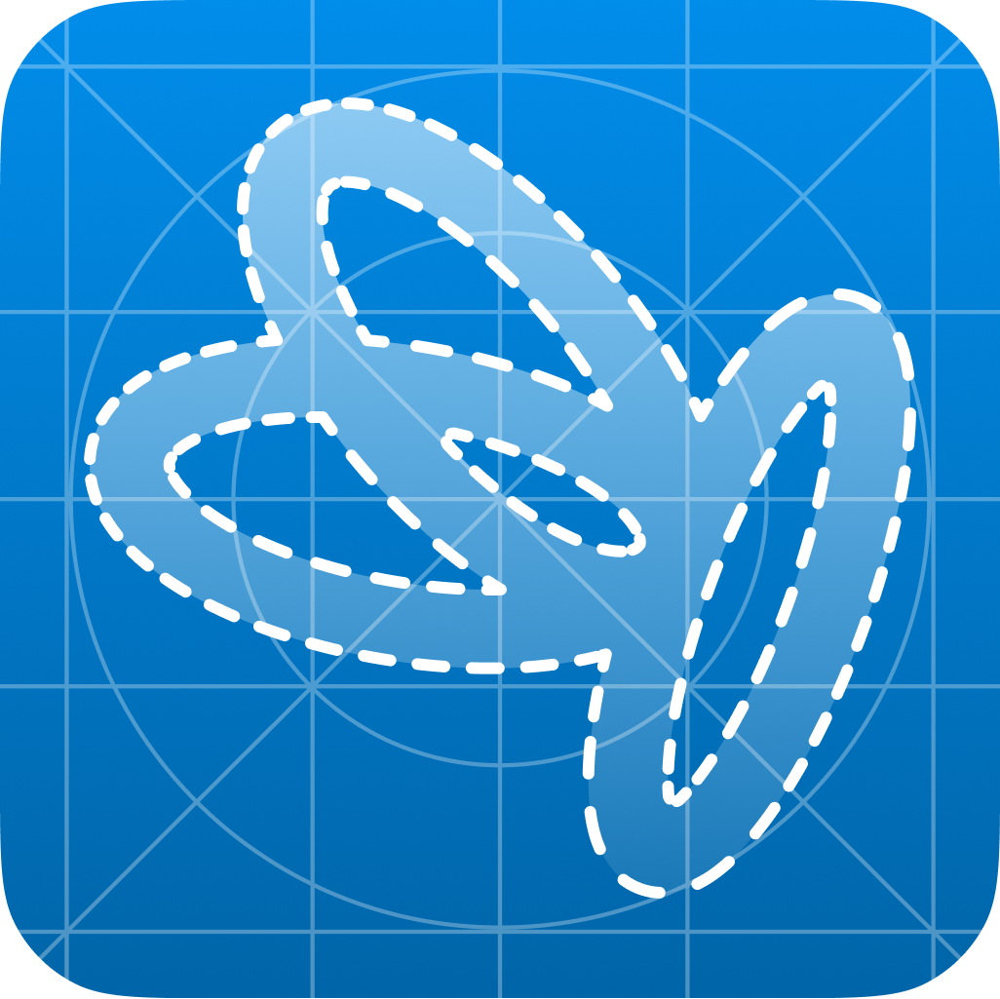

# 

{ width="300px" }

# Documentation technique de Papillon et des services associés.

!!! note warning "Documentation pour les développeurs et designers"
    Cette documentation est destinée aux développeurs et designers qui souhaitent contribuer à Papillon.
    Pour les utilisateurs, veuillez vous référer à la [documentation utilisateur](https://support.getpapillon.xyz/).

!!! note warning "Documentation en construction"
    La documentation est en construction, revenez plus tard si quelque chose n'est pas disponible !

-   :octicons-typography-24:{ .lg .middle } __Designer__

    ---

    Créez des maquettes, des prototypes et des designs pour Papillon. Vous pouvez contribuer à la charte graphique.

    [:octicons-arrow-right-24: Consulter](design/intro.md)

-   :octicons-file-code-24:{ .lg .middle } __Développer__

    ---

    Modifier le code source de Papillon pour ajouter des fonctionnalités ou corriger des bugs.

    [:octicons-arrow-right-24: Consulter](development/intro.md)

-   :octicons-code-of-conduct-24:{ .lg .middle } __Contribuer__

    ---

    Contribuer à la documentation, à la traduction, à la communication, à la recherche de bugs de Papillon.

    [:octicons-arrow-right-24: Consulter](contribute/intro.md)

-    :material-apps:{ .lg .middle } __Rejoindre la bêta__

    ---

    Une bêta de Papillon est disponible pour les utilisateurs qui souhaitent tester les nouvelles fonctionnalités.

    [:octicons-arrow-right-24: Rejoindre la bêta de Papillon](contribute/beta.md)

## Nos réseaux sociaux

- :fontawesome-brands-discord: [discord.gg/__papillonapp__](https://discord.gg/papillonapp){target=_blank}
- :fontawesome-brands-github-alt: [github.com/__PapillonApp__](https://github.com/PapillonApp){target=_blank}
- :fontawesome-brands-x-twitter: [twitter.com/__thepapillonapp__](https://twitter.com/thepapillonapp){target=_blank}
- :fontawesome-brands-instagram: [instragram.com/__thepapillonapp__](https://instagram.com/thepapillonapp){target=_blank}

## Mentions légales
- [:material-gavel: Politique de confidentialité](documents/privacy-policy.md)
- [:material-gavel: Conditions générales d'utilisation](documents/terms-of-service.md)

!!! note ""
    Papillon n'est affilié à aucune entreprise ou organisation. Papillon est un projet open-source et communautaire.
